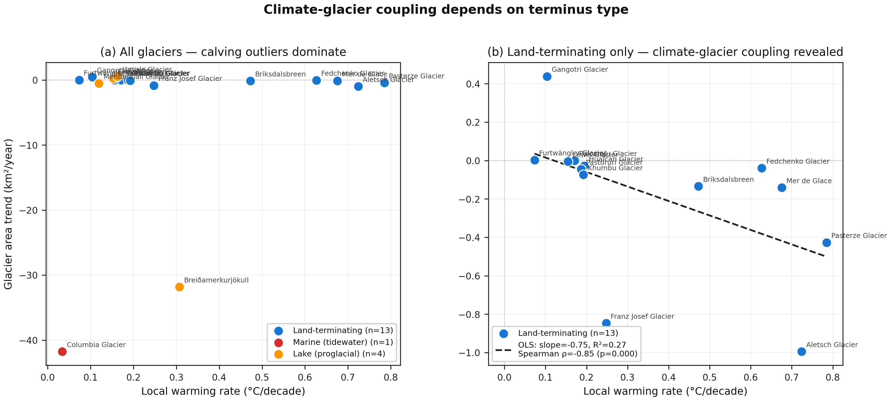
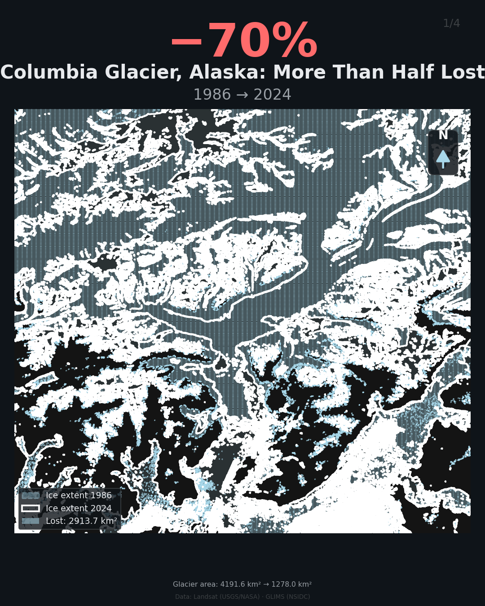
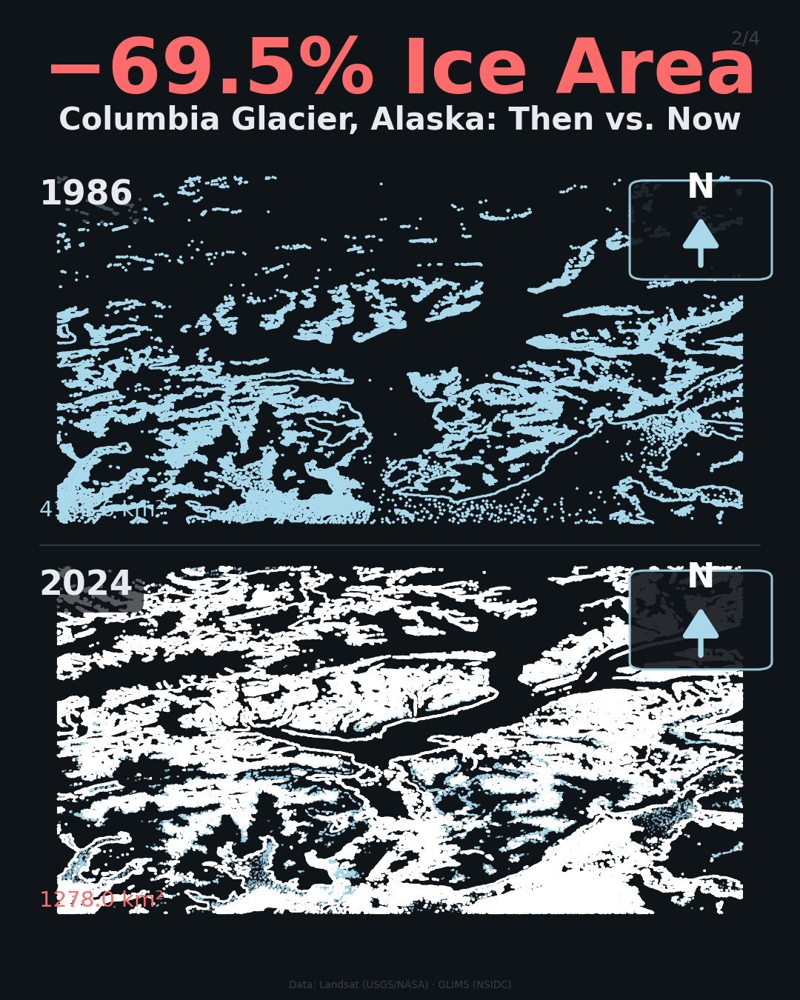
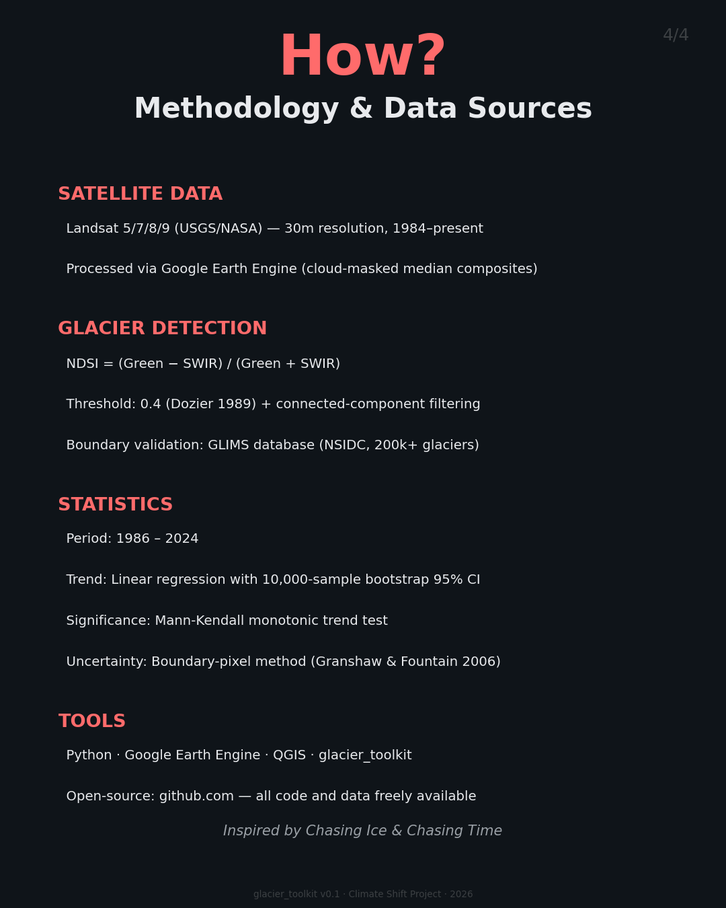

# climate-shift

> Global climate change visualization toolkit — European temperature shifts and worldwide glacier retreat from satellite imagery.

[](https://github.com/bijanf/climate-shift/actions/workflows/ci.yml)
[](https://github.com/bijanf/climate-shift/actions/workflows/codeql.yml)
[](LICENSE)
[](https://www.python.org/downloads/)
[](https://github.com/astral-sh/ruff)
[](https://github.com/pre-commit/pre-commit)

<p align="center">
  
</p>

<p align="center">
  <em>Local warming explains glacier retreat for land-terminating glaciers
  (Spearman ρ = −0.85, p = 0.0002), but not for marine/lake calving glaciers
  where dynamic instability dominates. Analysis of 18 glaciers across 12 regions,
  1985–2024.</em>
</p>

<p align="center">
  
</p>

<p align="center">
  <em>Columbia Glacier, Alaska has lost <strong>70% of its ice area</strong> since 1986.</em>
</p>

---

## What this is

Two complementary projects in one repository, both built for climate scientists who want to communicate the climate crisis with rigorous data and stunning visuals:

### 1. European climate shift analysis (legacy scripts)

Statistical analysis of how European temperatures have changed between the 1930-1959 baseline and the 1995-2024 modern period, using:

- **NOAA GHCN-Daily** weather station records (`plot_climate_shift.py`)
- **CRU TS v4.09** and **E-OBS v32** gridded climate datasets (`plot_climate_maps.py`)

Produces 45+ Instagram-ready visualizations: hero KDE plots, regional warming maps (Alps, Berlin, Paris, Madrid, Rome, Vienna), extreme heat day maps, and station-level analyses.

### 2. Global glacier retreat monitoring toolkit (`glacier_toolkit/`)

A complete Python package for analyzing the retreat of any glacier on Earth from satellite imagery. Inspired by the *Chasing Ice* and *Chasing Time* documentaries.

**One command:**
```bash
glacier-analyze --name aletsch
```
**You get:**
- 40 years of cloud-masked Landsat NDSI composites (cached)
- Glacier area time series with bootstrap 95% CIs
- Mann-Kendall trend significance test
- Four Instagram-ready slides (Ghost Ice, comparison, time series, methodology)
- Auto-generated Instagram caption with hashtags
- Publication-quality CSV and JSON outputs

---

## Features

### Global glacier registry

20 pre-configured glaciers spanning **every glaciated region on Earth**:

| Region | Glaciers |
|--------|----------|
| Alaska | Columbia, Mendenhall |
| Greenland | Jakobshavn (Sermeq Kujalleq) |
| Patagonia | Grey, Upsala |
| Andes | Palcaraju (Lake Palcacocha), Hualcan (Lake 513), Pastoruri |
| European Alps | Aletsch, Pasterze, Mer de Glace |
| Norway | Briksdalsbreen |
| Iceland | Breiðamerkurjökull |
| Himalayas | Gangotri, Khumbu |
| Pamir Mountains | Fedchenko |
| East Africa | Lewis (Mt Kenya), Furtwängler (Kilimanjaro) |
| Antarctica | Hektoria |
| New Zealand | Franz Josef |

Plus `--lat` / `--lon` flags to analyze **any glacier on Earth**.

### Five analysis modules

| Module | What it does |
|--------|--------------|
| `acquire/` | Download Landsat (GEE), Sentinel-2 (CDSE), GLIMS boundaries (NSIDC), Copernicus DEM |
| `analyze/` | NDSI / NDWI classification, area change, bootstrap CIs, Mann-Kendall trend test |
| `visualize/` | Ghost Ice overlays, before/after comparisons, global Robinson dashboard, Instagram carousels |
| `glof/` | Glacial Lake Outburst Flood risk: detection, growth rates, downstream exposure, multi-factor scoring |
| `pipelines/` | One-command CLI tools for single glaciers, global overviews, GLOF papers, social media |

### Statistical rigor

- **Bootstrap 95% CIs** with 10,000 resamples (Efron & Tibshirani 1993)
- **Mann-Kendall** monotonic trend test (no normality assumption)
- **Welch's t-test** for period comparisons
- **Boundary-pixel uncertainty** for glacier areas (Granshaw & Fountain 2006)
- **Cross-sensor harmonization** for L5/L7 → L8 (Roy et al. 2016)
- **Reproducible** — `seed=42` matches the existing climate shift project

### GLOF risk assessment for scientific papers

Multi-factor risk classification (LOW / MODERATE / HIGH / VERY HIGH) based on:

- Lake area and growth rate
- Dam type (moraine / ice / bedrock; per Emmer & Vilimek 2013)
- Estimated volume (Huggel et al. 2002 scaling)
- Downstream population exposure
- Flow distance to settlements
- Glacier steepness above the lake

Outputs LaTeX-ready risk tables for direct inclusion in papers.

---

## Quickstart

```bash
# Clone the repo
git clone https://github.com/bijanf/climate-shift.git
cd climate-shift

# Install with all dependencies
pip install -e ".[geo,gee]"

# One-time: authenticate Google Earth Engine
earthengine authenticate

# Analyze any glacier
glacier-analyze --name columbia
```

See [docs/QUICKSTART.md](docs/QUICKSTART.md) for the full walkthrough.

---

## Example output

After running `glacier-analyze --name columbia`, you get:

| Slide | Preview |
|-------|---------|
| **Ghost Ice overlay** — historical extent over modern imagery |  |
| **Before/After comparison** |  |
| **Methodology + sources** |  |

Plus a `columbia_caption.txt` with an auto-generated Instagram caption + hashtags, ready to post.

### Paper finding: terminus type controls climate-glacier coupling

When we apply a unified satellite-climate analysis to 18 glaciers across 12 regions
(1985–2024), the relationship between local warming rate and glacier retreat depends
critically on glacier terminus type:

| Subset | n | Spearman ρ | p-value | Interpretation |
|---|---|---|---|---|
| **All glaciers** | 18 | −0.40 | 0.10 | Calving outliers obscure signal |
| **Land-terminating** | 13 | **−0.85** | **0.0002** | Strong climate control ⭐ |
| **Marine/lake calving** | 5 | +0.40 | 0.50 | No correlation — dynamic instability dominates |

**Statistically significant per-glacier climate sensitivities (p < 0.05):**

| Glacier | Region | Sensitivity (km²/°C) | p-value |
|---|---|---|---|
| **Aletsch** | Alps Switzerland | −6.23 | 0.005 |
| **Pasterze** | Alps Austria | −2.27 | 0.007 |
| **Franz Josef** | New Zealand | **−5.48** | **0.001** |
| **Breiðamerkurjökull** | Iceland | −229.06 | 0.033 |

See [PAPER.md](PAPER.md) for the full paper roadmap and methodology.

### Validation case: Columbia Glacier, Alaska

| Metric | Value |
|---|---|
| Area in 1986 | 4,182 km² |
| Area in 2024 | 1,223 km² |
| Total change | **−2,959 km² (−70.8%)** |
| Linear trend | −81.5 km²/year |
| R² | 0.818 |
| Mann-Kendall | decreasing (p < 0.001) |

---

## Installation

### Standard install

```bash
pip install -e ".[geo,gee]"
```

### Optional dependency groups

| Group | What it adds | Use when |
|-------|--------------|----------|
| `geo` | rasterio, rioxarray, geopandas, cartopy | Always (for raster/vector analysis) |
| `gee` | earthengine-api | You want to download Landsat imagery |
| `dev` | ruff, mypy, pytest, pre-commit | You're contributing |
| `all` | Everything above | You want the full experience |

### System requirements

- **Python**: 3.10, 3.11, or 3.12
- **OS**: Linux, macOS, or Windows
- **Disk space**: ~10 GB for satellite data cache (per ~10 glaciers)
- **Network**: Required for first-time downloads (cached afterward)
- **Google Earth Engine account**: Free for non-commercial research

---

## Usage

### CLI commands (after `pip install -e .`)

```bash
# Single glacier — full analysis + carousel
glacier-analyze --name aletsch
glacier-analyze --lat -13.95 --lon -70.83 --glacier-name "Quelccaya"

# Global dashboard — world map of all tracked glaciers
glacier-global

# GLOF risk assessment — Andes paper pipeline
glacier-glof

# Quick Instagram content — same as glacier-analyze
glacier-social --name columbia
```

### Python API

```python
from glacier_toolkit.config import get_glacier
from glacier_toolkit.acquire.landsat import export_timeseries
from glacier_toolkit.analyze.glacier_area import (
    build_area_timeseries,
    compute_area_change,
    fit_linear_trend,
)
from glacier_toolkit.visualize.ghost_ice import make_ghost_ice_slide

# 1. Pick a glacier
glacier = get_glacier("aletsch")

# 2. Download satellite data (cached)
ndsi_files = export_timeseries(glacier, year_start=1985, year_end=2024)

# 3. Compute time series
ts_df = build_area_timeseries(ndsi_files)
change = compute_area_change(ts_df)
trend = fit_linear_trend(ts_df)

print(f"Aletsch lost {abs(change['change_pct']):.1f}% of its area")
print(f"Retreat rate: {trend['slope_km2_per_year']:.2f} km²/year")
print(f"95% CI: [{trend['ci_lower']:.2f}, {trend['ci_upper']:.2f}]")
```

---

## Project structure

```
climate-shift/
├── glacier_toolkit/        # The main Python package
│   ├── config.py           # Glacier registry, theme, constants
│   ├── style.py            # Dark-theme matplotlib helpers
│   ├── acquire/            # Satellite & boundary data acquisition
│   ├── analyze/            # NDSI/NDWI classification, statistics
│   ├── visualize/          # Instagram-ready slides
│   ├── glof/               # GLOF risk assessment
│   └── pipelines/          # CLI entry points
│
├── tests/                  # 90 pytest tests, no network required
├── docs/                   # ARCHITECTURE.md, QUICKSTART.md, images/
├── .github/                # CI workflows, issue templates, PR template
│
├── plot_climate_shift.py   # Legacy: GHCN station temperature analysis
├── plot_climate_maps.py    # Legacy: CRU TS / E-OBS gridded maps
├── instagram_captions.txt  # Captions for the European climate slides
│
├── pyproject.toml          # Modern Python packaging
├── .pre-commit-config.yaml # Auto-format on commit
├── .editorconfig           # Cross-editor consistency
├── LICENSE                 # MIT
├── CONTRIBUTING.md
├── CODE_OF_CONDUCT.md
├── CHANGELOG.md
└── README.md               # ← you are here
```

See [docs/ARCHITECTURE.md](docs/ARCHITECTURE.md) for the detailed module breakdown and design decisions.

---

## Development

```bash
# Install with dev dependencies
pip install -e ".[geo,gee,dev]"

# Install pre-commit hooks (auto-format on commit)
pre-commit install

# Run tests
pytest tests/                                    # 90 tests, ~7 seconds
pytest tests/ --cov=glacier_toolkit              # with coverage
pytest tests/test_glof.py -v                     # one file
pytest -k "test_high_risk_lake" -v               # one test by name

# Lint and format
ruff check glacier_toolkit/ tests/               # check
ruff check --fix glacier_toolkit/ tests/         # auto-fix
ruff format glacier_toolkit/ tests/              # format

# Type check (informational)
mypy glacier_toolkit/
```

CI runs on Python 3.10, 3.11, and 3.12 on every push and PR. See [.github/workflows/ci.yml](.github/workflows/ci.yml).

---

## Data sources

| Dataset | Used by | License | Citation |
|---------|---------|---------|----------|
| Landsat 5/7/8/9 | `acquire/landsat.py` | Public domain | [USGS](https://www.usgs.gov/landsat-missions) |
| Sentinel-2 | `acquire/sentinel.py` | Free, attribution | [Copernicus](https://dataspace.copernicus.eu) |
| GLIMS glacier outlines | `acquire/glims.py` | Free | [NSIDC](https://nsidc.org/data/glims) |
| Copernicus DEM GLO-30 | `acquire/dem.py` | Free | [AWS Open Data](https://registry.opendata.aws/copernicus-dem/) |
| GHCN-Daily | `plot_climate_shift.py` | Public domain | Menne et al. 2012 |
| CRU TS v4.09 | `plot_climate_maps.py` | Free, attribution | Harris et al. 2020 |
| E-OBS v32 | `plot_climate_maps.py` | Free, attribution | Cornes et al. 2018 |

---

## Citation

If you use this toolkit in research, please cite:

```bibtex
@software{climate_shift_toolkit_2026,
  author       = {Bijan Fallah},
  title        = {climate-shift: Global glacier retreat monitoring toolkit},
  year         = 2026,
  url          = {https://github.com/bijanf/climate-shift},
  version      = {0.1.0}
}
```

And the underlying datasets per their individual citations above.

---

## Roadmap

- [ ] Add Sentinel-2 RGB true-color export for prettier slides
- [ ] Build a global GLOF database from the toolkit (paper pipeline)
- [ ] Add automatic ML-based glacier mask refinement (HED-UNet)
- [ ] Web-based interactive map of all tracked glaciers
- [ ] Drone photogrammetry workflow integration (WebODM)
- [ ] Time-lapse video assembly (MP4 with ffmpeg)
- [ ] Publish v0.1.0 to PyPI

See [open issues](https://github.com/bijanf/climate-shift/issues) and [CHANGELOG.md](CHANGELOG.md).

---

## Contributing

Contributions are welcome! See [CONTRIBUTING.md](CONTRIBUTING.md) for the full guide.

The fastest way to help:

1. **Add a glacier** to the registry — see [glacier request template](.github/ISSUE_TEMPLATE/glacier_request.yml)
2. **Test on a new region** and report what works and what doesn't
3. **Improve documentation** — typos, examples, clearer explanations
4. **Share visualizations** you generate so others can see what's possible

---

## Inspiration

- *Chasing Ice* (2012) — James Balog and the Extreme Ice Survey
- *Chasing Time* (2024) — sequel documenting accelerating retreat
- The work of thousands of glaciologists making freely available data that anyone can use

---

## License

MIT — see [LICENSE](LICENSE).

Free for any use including commercial. Attribution appreciated but not required.

---

## Author

**Bijan Fallah** — bijan.fallah@gmail.com
